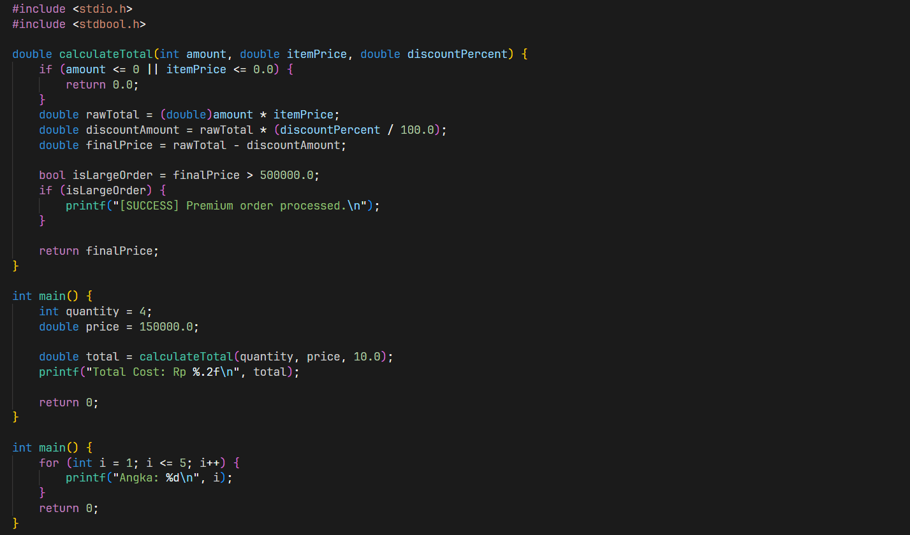
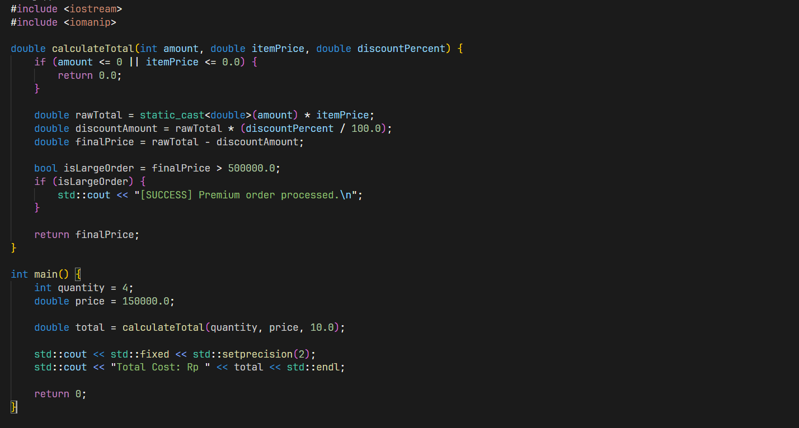
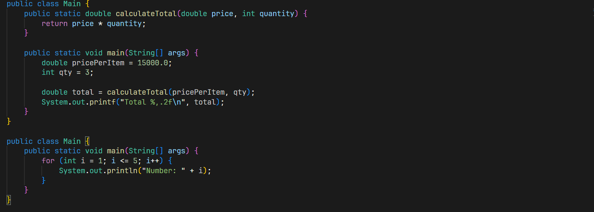
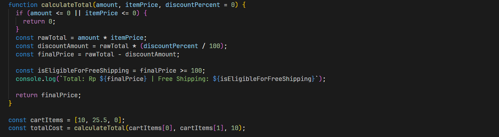
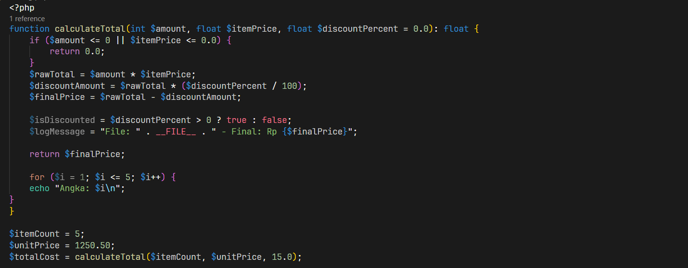
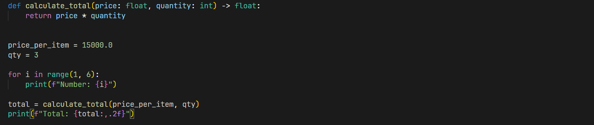
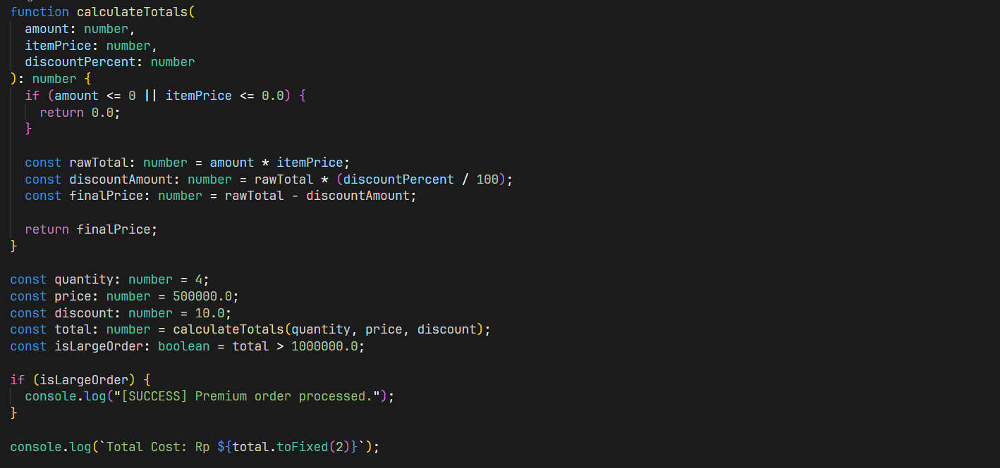
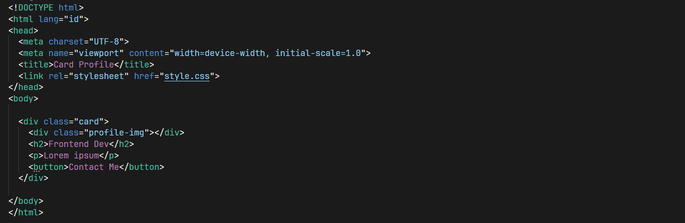
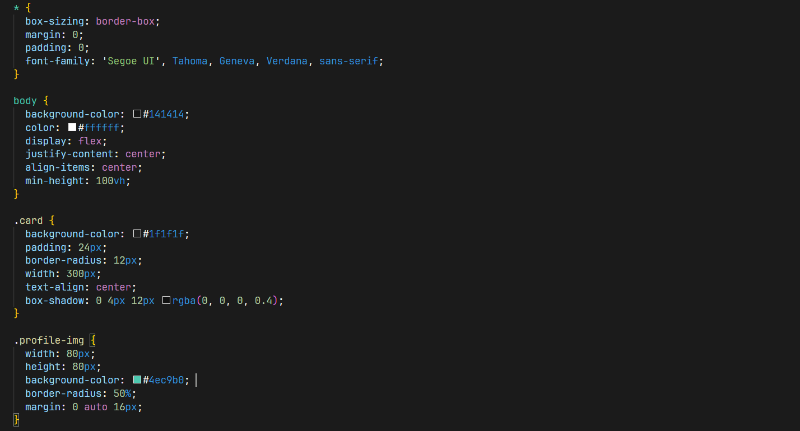

# xenodark README

## Working with Markdown

- PREVIEWS

- C
  

- C++
  

- JAVA
  

- JavaScript
  

- PHP
  

- PYTHON
  

- TYPESCRIPT
  

- HTML
  

- CSS
  

You can author your README using Visual Studio Code. Here are some useful editor keyboard shortcuts:

- Split the editor (`Cmd+\` on macOS or `Ctrl+\` on Windows and Linux).
- Toggle preview (`Shift+Cmd+V` on macOS or `Shift+Ctrl+V` on Windows and Linux).
- Press `Ctrl+Space` (Windows, Linux, macOS) to see a list of Markdown snippets.

## For more information

- [Visual Studio Code's Markdown Support](http://code.visualstudio.com/docs/languages/markdown)
- [Markdown Syntax Reference](https://help.github.com/articles/markdown-basics/)

**Enjoy!**
